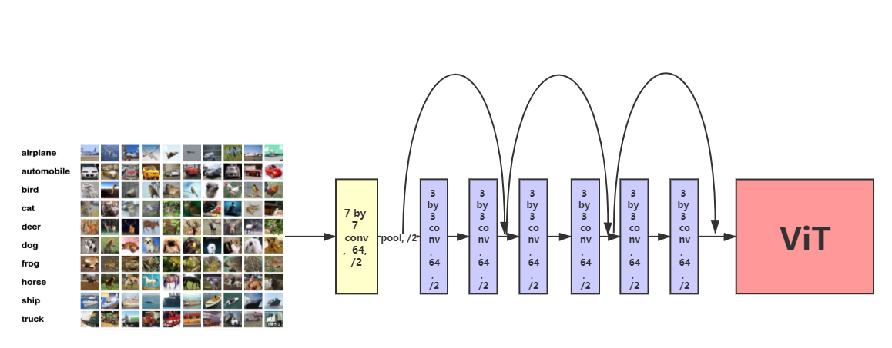

# Compter Vision final project
This is a repository for my computer vision final project, which construct a hybrid ViT and compare it with the same_number_of_parameters model, resnet40, which modified from resnet34, and the same_number_of_FLOPs model, resnet71, which modified from resnet50.

The project is done on google colab. click the link to open the notebook.

## models in the experiment
- Baseline: [HybridViT_v2](https://drive.google.com/file/d/1-7kCyc2bYorM_I9S0Cdss025HEmpqeiB/view?usp=sharing)

- with same number of parameters: [resnet40](https://drive.google.com/file/d/1WkMeI3LCDfhL9k1OwpGd28KQqmBT-SBi/view?usp=sharing)

- with same number of FLOPs: [resnet71](https://drive.google.com/file/d/1-2p1GoI5xc199o6JExdMAYDoyvW-sN97/view?usp=sharing)

click the link to get the trained model.
